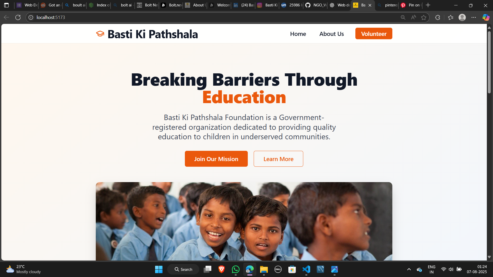
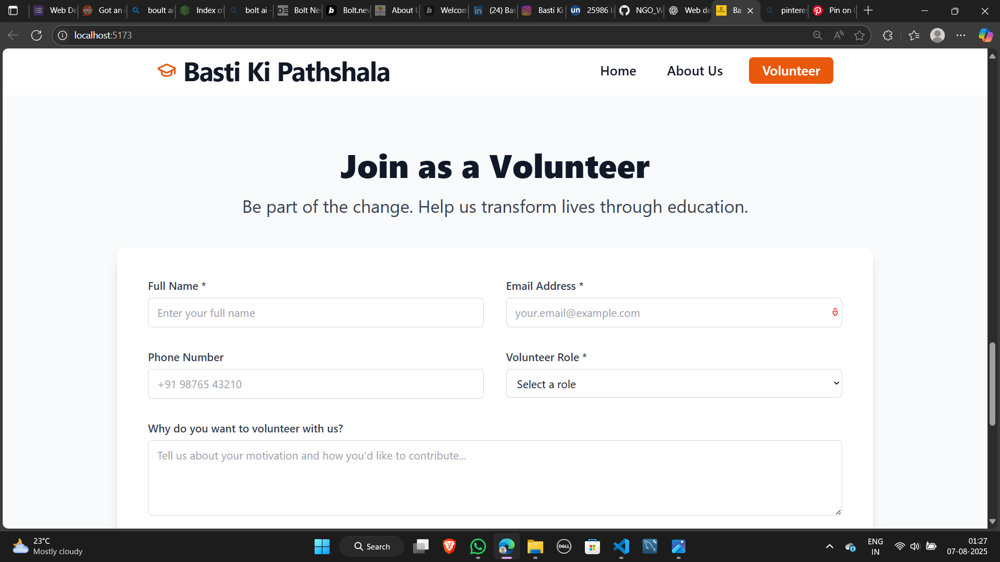
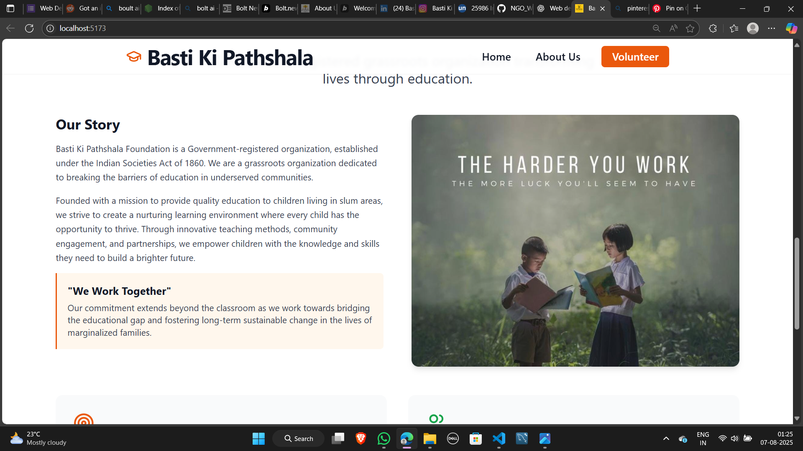

# Basti Ki Pathshala – NGO Website 🌱

A modern, responsive website for the **Basti Ki Pathshala Foundation**, developed using **React**, **TypeScript**, **Tailwind CSS**, and **Vite**.

---

## 🌟 Features

- ✨ Beautiful, responsive landing page  
- 📝 Volunteer registration form  
- 📚 About section with mission and vision  
- 📈 Impact statistics  
- 🔗 Social and contact links  
- 🖼️ Uses local images from `src/screenshots/` folder

---

## 📸 Screenshots

<p align="center">
  
  
</p>
<p align="center">
  
  
</p>

---

## 🚀 Getting Started

### 📦 Prerequisites

- [Git](https://git-scm.com/)
- [Node.js](https://nodejs.org/)
- [PNPM](https://pnpm.io/) (or use `npm` / `yarn` if preferred)

---

### 🛠️ Installation

```bash
# Clone the repository
git clone https://github.com/Mohammedsabeel063/NGO_WEBSITE.git
cd NGO_WEBSITE

# Install dependencies
pnpm install
# or
npm install

# Start development server
pnpm dev
# or
npm run dev
